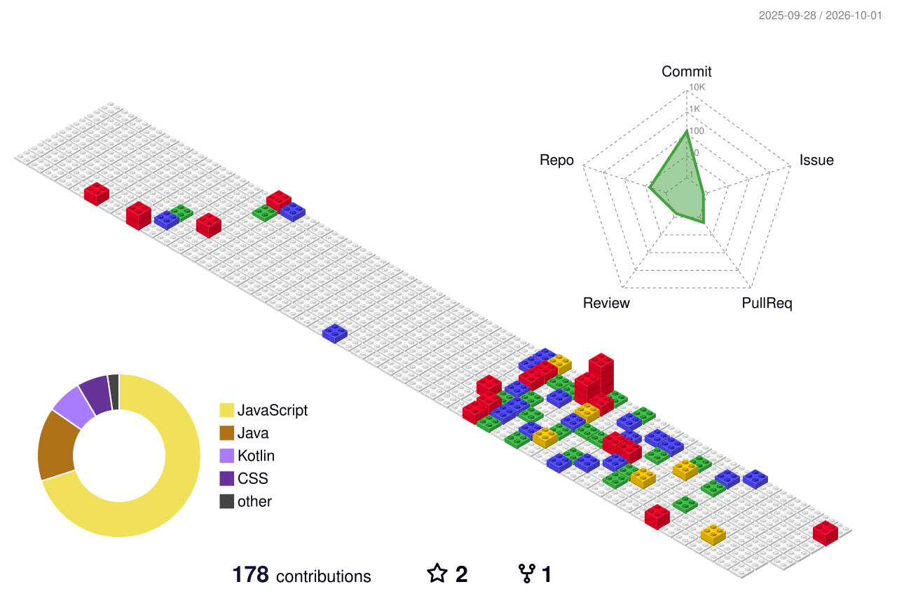

  <!-- Profile Details Summary Card -->
  <picture>
    <source media="(prefers-color-scheme: dark)" srcset="https://github-profile-summary-cards.vercel.app/api/cards/profile-details?username=Jenish995&theme=dark&hide_border=true" />
    <source media="(prefers-color-scheme: light)" srcset="https://github-profile-summary-cards.vercel.app/api/cards/profile-details?username=Jenish995&theme=graywhite&hide_border=true" />
    
  </picture>
    

  <!-- GitHub Streak & Productive Time (Side-by-Side) -->
  <picture>
    <source media="(prefers-color-scheme: dark)" srcset="https://streak-stats.demolab.com?user=Jenish995&theme=dark&hide_border=true&short_numbers=true&ring=EBEBEB&fire=EBEBEB&currStreakLabel=EBEBEB" />
    <source media="(prefers-color-scheme: light)" srcset="https://github-readme-streak-stats.herokuapp.com?user=Jenish995&theme=graywhite&short_numbers=true&hide_border=true" />
    
  </picture>
  <picture>
    <source media="(prefers-color-scheme: dark)" srcset="https://github-profile-summary-cards.vercel.app/api/cards/productive-time?username=Jenish995&theme=dark&hide_border=true&utcOffset=5.45" />
    <source media="(prefers-color-scheme: light)" srcset="https://github-profile-summary-cards.vercel.app/api/cards/productive-time?username=Jenish995&theme=graywhite&hide_border=true&utcOffset=5.45" />
    
  </picture>
    

  <!-- Top Languages (Side-by-Side Symmetrical) -->
  <picture>
    <source media="(prefers-color-scheme: dark)" srcset="https://github-profile-summary-cards.vercel.app/api/cards/repos-per-language?username=Jenish995&theme=dark&hide_border=true" />
    <source media="(prefers-color-scheme: light)" srcset="https://github-profile-summary-cards.vercel.app/api/cards/repos-per-language?username=Jenish995&theme=graywhite&hide_border=true" />
    
  </picture>
  <picture>
    <source media="(prefers-color-scheme: dark)" srcset="https://github-profile-summary-cards.vercel.app/api/cards/most-commit-language?username=Jenish995&theme=dark&hide_border=true" />
    <source media="(prefers-color-scheme: light)" srcset="https://github-profile-summary-cards.vercel.app/api/cards/most-commit-language?username=Jenish995&theme=graywhite&hide_border=true" />
    
  </picture>
    

  <!-- Activity Graph (Full-width showcase) -->
  <picture>
    <source media="(prefers-color-scheme: dark)" srcset="https://github-readme-activity-graph.vercel.app/graph?username=Jenish995&theme=high-contrast&bg_color=none&area=true&hide_border=true" />
    <source media="(prefers-color-scheme: light)" srcset="https://github-readme-activity-graph.vercel.app/graph?username=Jenish995&bg_color=ffffff&color=000000&line=000000&point=000000&area=true&area_color=000000&hide_border=true" />
    
  </picture>
    

  <!-- 3D Contribution Graph -->
  <picture>
    <source media="(prefers-color-scheme: dark)" srcset="profile-3d-contrib/profile-night-green.svg">
    <source media="(prefers-color-scheme: light)" srcset="profile-3d-contrib/profile-green-animate.svg">
    
  </picture>
   

  <!-- Contribution Grid Snake Animation -->
  <picture>
    <source media="(prefers-color-scheme: dark)" srcset="https://raw.githubusercontent.com/Jenish995/Jenish995/output/github-contribution-grid-snake-dark.svg">
    <source media="(prefers-color-scheme: light)" srcset="https://raw.githubusercontent.com/Jenish995/Jenish995/output/github-contribution-grid-snake.svg">
    
  </picture>

